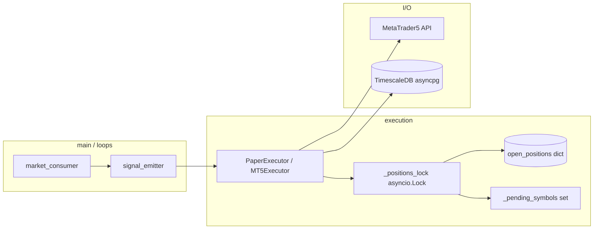

# ARCHITECTURE — ClawdBot (resumen ejecución)

## Sincronización

| Recurso | Mecanismo |
|---------|-----------|
| Mutación posiciones | `asyncio.Lock` (`_positions_lock`) |
| Conteo vs max | `RiskManager._open_count` + `_pending_symbols` hasta persistencia |
| MT5 ↔ libro local | `sync_positions_with_exchange()` (reconcile ghosts / adopt) |
| Estado disco | `state.json` (paper), TimescaleDB `trades` |

## Threads

Proceso único asyncio (AGENTS.md). MT5 API se llama con `asyncio.to_thread` donde aplica; no hay thread Python dedicado al trading clásico.
