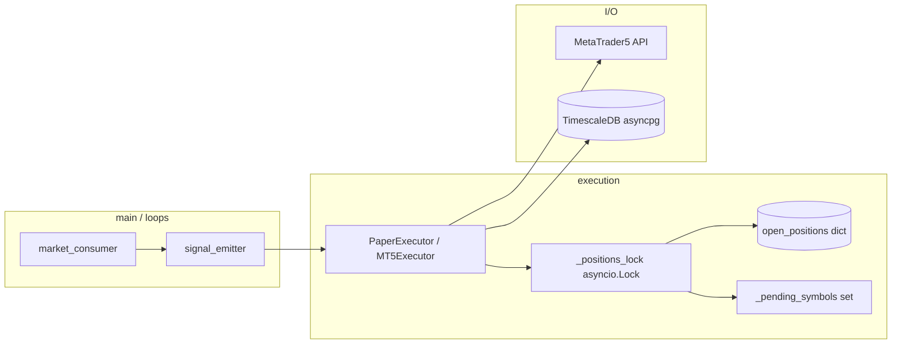

# ClawdBot

[](https://www.python.org/)
[-0078D6?logo=windows&logoColor=white)](#notes)
[](https://www.timescale.com/)

> Institutional-grade algorithmic trading bot for MT5 and paper mode.
> Python 3.12+ · asyncio · TimescaleDB · XGBoost · Windows-only MT5 / PyQt6

```text
╔══════════════════════════════════════════════════════════════════════════════╗
║                           CLAWDBOT: LIVE LOOP                               ║
║                                                                              ║
║  market_consumer  ──►  signal_emitter  ──►  executor (MT5/Paper)            ║
║        │                        │                       │                   ║
║        ▼                        ▼                       ▼                   ║
║   MT5 ticks               ML predictor           Orders / Positions          ║
║        │                        │                       │                   ║
║        ▼                        ▼                       ▼                   ║
║   TimescaleDB ◄─────────────── risk_manager ◄────────── state                ║
║                                                                              ║
╚══════════════════════════════════════════════════════════════════════════════╝
```

## Highlights

- Async single-process loop with coordinated tasks (no event bus yet)
- MT5 live mode + paper simulation (long-only execution)
- XGBoost inference with per-symbol thresholds
- TimescaleDB hypertables for OHLCV and trades
- Rich TUI + optional web dashboard (aiohttp :8080)

## Architecture

The current runtime is an asyncio loop with direct calls between modules. A dedicated
event bus is planned (see `BACKLOG.md`). Concurrency safety for positions uses an
`asyncio.Lock` + `_pending_symbols` gate (see `ARCHITECTURE.md`).



## Project Layout

```
Bot/
├── bot/                   # Main bot loop, dashboards, and event loop coordination
├── strategy/              # ML models, signal generation, feature engineering
├── execution/             # Order Management System (OMS)
├── risk/                  # Risk management and position sizing
├── database/              # TimescaleDB connection management
├── data_ingestion/        # Market data feeds (MT5 and polling)
├── utils/                 # Configuration, logging, and utilities
├── gui/                   # PyQt6 desktop GUI (Windows-only)
├── models/                # Pre-trained XGBoost model files
├── scripts/               # Utility scripts and audits
├── logs/                  # Runtime logs
├── tests/                 # pytest tests
├── main.py                # Application entry point
├── docker-compose.yml     # TimescaleDB + Redis services
├── requirements.txt       # Python dependencies
├── .env.example           # Environment variable template
├── ARCHITECTURE.md        # Execution details and locking model
├── BACKLOG.md             # Deferred items (event bus, Redis, etc.)
└── AGENTS.md              # Cursor Cloud notes
```

## Prerequisites

- Docker >= 24 and Docker Compose >= 2
- Python 3.12+
- MT5 terminal + account if running live mode (Windows-only)

## Quick Start

### 1) Configure environment

```bash
cp .env.example .env
```

Set:
- `EXECUTION_MODE=paper` on Linux
- `MT5_LOGIN`, `MT5_PASSWORD`, `MT5_SERVER` for live mode

### 2) Start TimescaleDB

```bash
docker compose up -d db
docker compose ps
```

Optional Redis (not required by default loop):

```bash
docker compose up -d redis
```

### 3) Install dependencies

```bash
python -m venv .venv
source .venv/bin/activate          # Windows: .venv\Scripts\activate
python -m pip install --upgrade pip
pip install -r requirements.txt
```

Linux/CI: filter `MetaTrader5`, `PyQt6`, `pyqtgraph` before install. See `AGENTS.md`.

### 4) Run

```bash
python main.py
```

On Linux, the bot exits after startup because MT5 feed is unavailable.

## Configuration

All settings are in `.env`. See `.env.example` for full defaults.

Core variables:
- `EXECUTION_MODE` (`mt5` or `paper`)
- `MT5_LOGIN`, `MT5_PASSWORD`, `MT5_SERVER`
- `DB_USER`, `DB_PASSWORD`, `DB_HOST`, `DB_PORT`, `DB_NAME`
- `GEMINI_API_KEY` (optional sentiment)
- `TELEGRAM_BOT_TOKEN`, `TELEGRAM_CHAT_ID` (optional alerts)

## Testing

```bash
python -m pytest tests/ -q --tb=short
```

Current coverage is minimal (smoke checks + targeted regressions). See `BUGS_REPORT.md` and `CHANGES.md` for audit context.

## Status / Roadmap

Active production loop is **asyncio direct-call** (no bus). Deferred items are tracked in
`BACKLOG.md`:

- Event bus abstraction
- Optional Redis cache/pub-sub
- GUI realtime improvements
- Short selling model
- Live Sharpe / profit metrics

## Notes

- MT5 + PyQt6 are Windows-only
- Web dashboard runs on `:8080` only when the full loop is active
- See `ARCHITECTURE.md` for synchronization details
- Known issues and fixes: `BUGS_REPORT.md` and `CHANGES.md`

## Disclaimer

This software is for educational and research use. Algorithmic trading involves risk.
Do not trade with funds you cannot afford to lose.
